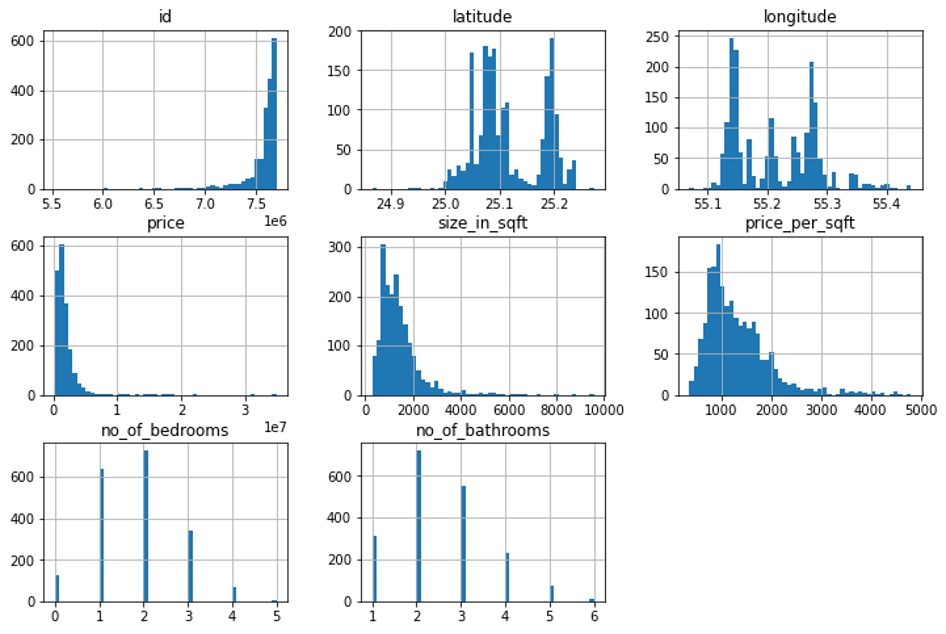
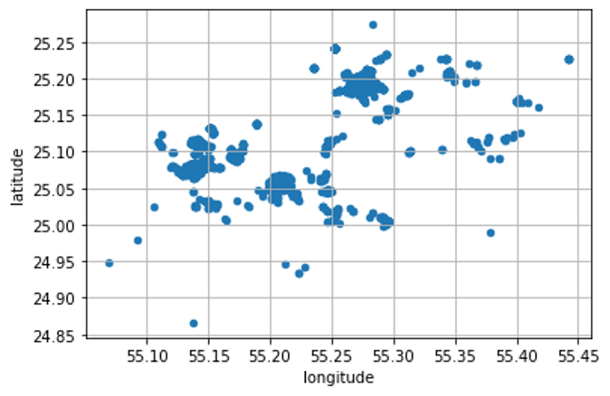
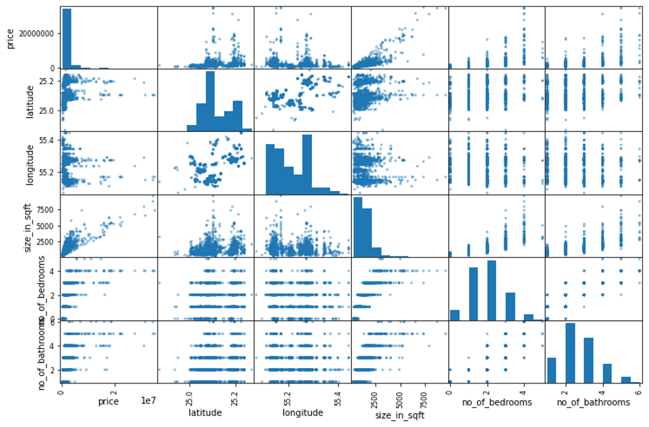
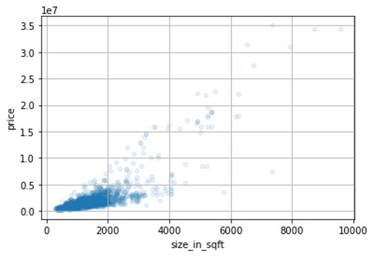

# Dubai Housing Price Prediction

I prepared this Notebook as my first assignment for Graduate-Level Machine Learning, CS7267 at Kennesaw State University. It presents an analysis of the Dubai housing market using data exploration, visualization, and predictive modeling techniques.

## Key Steps and Highlights

### 1) Data Loading and Exploration
- Loaded the Dubai housing dataset and explored it by displaying sample rows to understand its structure and features.
- Analyzed the distribution of neighborhoods, with 'Downtown Dubai' and 'Dubai Marina' being the most common.
- Identified minimum and maximum property prices, ranging from 220,000 to 35,000,000 AED.
- Generated histograms to understand the distribution of quantitative features like property size, number of bedrooms, and bathrooms.

### 2) Geographical Scatterplot
- Created a geographical scatterplot to visualize the spatial distribution of properties in Dubai, showing how locations affect property prices.

### 3) Correlation Analysis
- Generated a correlation matrix and a correlation heatmap to analyze relationships between features. Key correlations were identified, such as the positive correlation between price and size in square feet.
- Created additional derived features, like **bedrooms per bathroom**, to enhance model interpretability.

### 4) Data Preparation
- Dropped unnecessary columns, such as **price_per_sqft**, and split the dataset into training and test sets (80/20 split).
- Constructed transformation pipelines for numerical features (using `StandardScaler`) and categorical features (using `OneHotEncoder` and `OrdinalEncoder`). The data preparation ensured all features were appropriately scaled or encoded for modeling.

### 5) Predictive Modeling
- **Linear Regression**: Trained a linear regression model using a pipeline that included data preprocessing. The model's performance was evaluated with an RMSE of approximately 1,418,198 AED and an R² score of 0.75.
- **LASSO Regression**: Used LASSO regression for feature selection and regularization. Despite efforts to tune hyperparameters using Grid Search, the LASSO model did not provide significant improvements in RMSE or R², with an RMSE similar to linear regression at 1,418,198 AED and an R² score of 0.75.
- **Random Forest Regression**: To improve results, a Random Forest model was applied. This ensemble model significantly reduced the RMSE to approximately 982,111 AED and increased the R² score to 0.88. Hyperparameter tuning further refined the model, resulting in a final RMSE of 957,671 AED and an R² score of 0.89.

### 6) Model Evaluation and Results
- Evaluated model performance using RMSE and R² scores to understand prediction accuracy and model fit.
- Compared models: Linear Regression and LASSO provided baseline results, while Random Forest Regression significantly outperformed both in terms of accuracy and feature importance.

## Summary
- Explored the Dubai housing dataset to understand feature distributions and relationships.
- Developed multiple predictive models, starting with Linear Regression and LASSO, and achieved significant improvements with Random Forest Regression.
- Identified key features influencing housing prices, such as property size, number of bedrooms, and location.
- Demonstrated skills in data exploration, feature engineering, model training, and evaluation.

